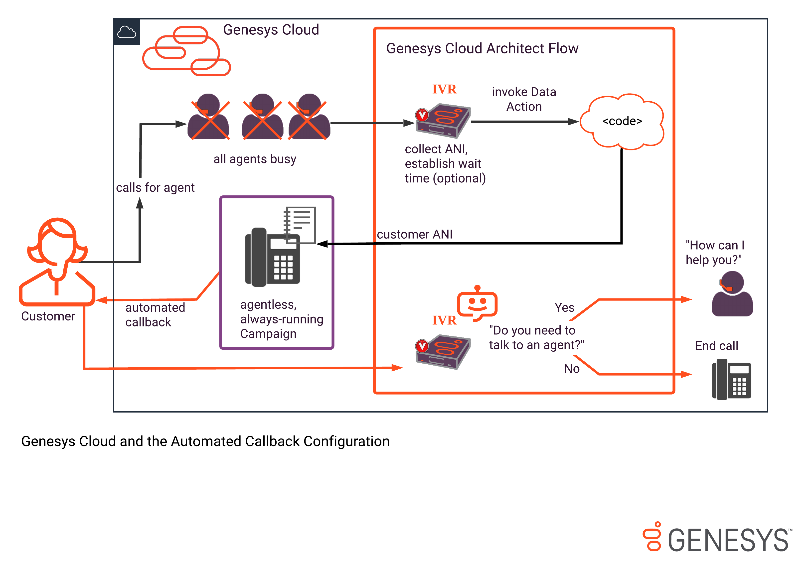
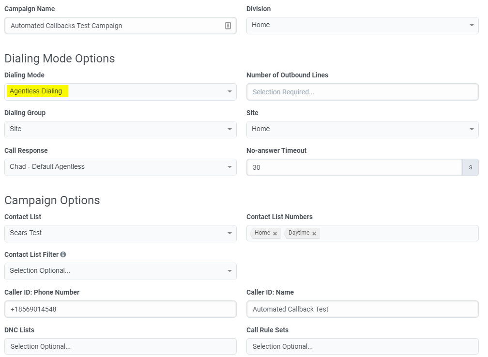
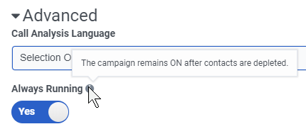
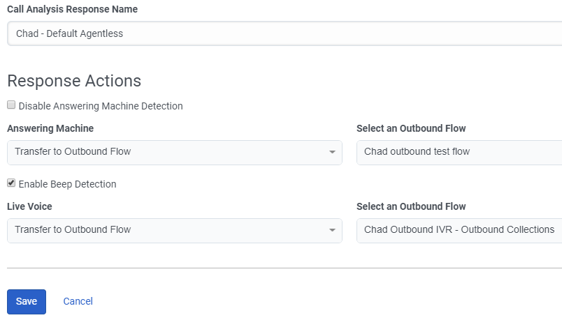

#  Automate callbacks using always-running campaigns and data actions
This Genesys Cloud Blueprint explains how to configure automated callbacks by using data actions to add numbers to an agentless always-running outbound dialing campaign on Genesys Cloud. This enables a user who called at a time when no agents were available to receive a callback after a designated time. The callback is based on parameters configured in an Architect flow. If desired, you can have the user confirm that they still need help, or send the call directly to an agent.



### Definitions:

* **Genesys Cloud** - The Genesys cloud-based contact center platform. Genesys Cloud is the platform where you configure flows, data actions, and outbound campaigns. For more information, see the [Genesys Cloud Resource Center home page](https://help.mypurecloud.com/ "Opens the Genesys Cloud Resource Center home page").
* **Architect Flows** - An easy-to-learn drag and drop web-based design tool that creates flows for media types. For more information, see the [Architect overview](https://help.mypurecloud.com/articles/?p=1441 "Opens the Architect overview article").
* **Data Actions** - Either preconfigured static actions or custom actions that you create using the Genesys Platform API. You can use these data actions to make routing decisions within your interaction flow in Architect, to present information to your agents in Scripts, or to act on data in other ways.  For more information, see [About the Genesys Cloud data actions integration](https://help.mypurecloud.com/articles/?p=144553 "Opens the About the Genesys Cloud data actions integration article").

## Specialized knowledge
Implementing this solution requires experience in several areas or a willingness to learn:
* Administrator-level knowledge of Genesys Cloud
* Familiarity with Architect flows
* An understanding of how to use data actions
* Familiarity with configuring Outbound campaigns

## Genesys Cloud account requirements

This solution requires a Genesys Cloud 2+ license. For more information on licensing, see [Genesys Cloud Pricing](https://www.genesys.com/pricing "Opens the pricing article").

The recommended Genesys Cloud role for the solutions engineer is Master Admin. For more information on Genesys Cloud roles and permissions, see the [Roles and permissions overview](https://help.mypurecloud.com/?p=24360 "Opens the Roles and permissions overview article").

## Prerequisite configuration and considerations

Setting up automated callbacks requires  you to configure the necessary pieces within the Genesys Cloud environment. You set up a campaign that automatically places calls when contact records are added to the contact list via API. The outbound-dialer campaign calls the contacts using Call Analysis (CPD), and you can send the responding person or answering machine to outbound Architect flows configured to handle the answered call as desired. For example, you could transfer all calls answered by a person directly to an agent while sending the answering machines to a recording. Or you might ask people who answer whether they still need help before transferring them to an agent.

Before you automate callbacks, ensure that you have resolved how you plan to handle the following points:

* Are you planning to run other outbound campaigns with the same agent pool that is receiving the calls from the automated callback agentless campaign? In the automated callback scenario, which uses an agentless campaign that does indirectly send calls to an agent, another campaign with the same queue won’t pace correctly unless you set it up with this scenario in mind.
* Do you need a separate queue for answered automated callbacks?
* Do you need to configure scheduling to dial callbacks at a certain time or under certain conditions, such as when agent occupancy is at acceptable levels? By default, when your data action adds a record to the campaign for a callback, it is dialed immediately.

### High-level procedure for automated callback configuration

* Create an Architect flow that directs answered automated callbacks as desired using a call-analysis response. This blueprint does not explain how to use Architect. Refer instead to the [Architect overview](https://help.mypurecloud.com/articles/?p=1441 "Opens the Architect overview article") in the Genesys Cloud Resource Center.
* Create a contact list.
* Create an agentless, always-running campaign that uses the call-analysis response you created.
* Create a data action JSON file that inserts contact numbers into the campaign for callbacks.

## Procedure
1. Create a contact list that supports contacts being added via API. For instructions, see [Dialer Call List Management](https://developer.mypurecloud.com/api/tutorials/call-list-management/index.html?language=python&step=1 "Opens the Dialer Call List Management article").

2. Create a Data Action JSON file that inserts the numbers to be added to the always-running campaign for automated callback.

The following is a sample JSON Data Action:
```
{
  "name": "Perpetual Campaign Callback DevNullSandbox - Exported 2020-02-21 @ 16:19",
  "integrationType": "purecloud-data-actions",
  "actionType": "custom",
  "config": {
    "request": {
      "requestUrlTemplate": "/api/v2/outbound/contactlists/${input.contactListId}/contacts?priority=${input.Priority}&doNotQueue=false",
      "requestType": "POST",
      "headers": {},
      "requestTemplate": "[{\n   \n    \"data\": {\n      \"contact number\": \"${input.PhoneNumber}\",\n      \"full name\": \"${input.FullName}\"\n    }\n  }]"
    },
    "response": {
      "translationMap": {
        "callback": "$.[0]"
      },
      "translationMapDefaults": {},
      "successTemplate": "${callback}"
    }
  },
  "contract": {
    "input": {
      "inputSchema": {
        "type": "object",
        "required": [
          "contactListId"
        ],
        "properties": {
          "contactListId": {
            "type": "string"
          },
          "Priority": {
            "type": "boolean"
          },
          "PhoneNumber": {
            "type": "string"
          },
          "FullName": {
            "type": "string"
          }
        },
        "additionalProperties": true
      }
    },
    "output": {
      "successSchema": {
        "type": "object",
        "properties": {
          "id": {
            "type": "string"
          }
        },
        "additionalProperties": true
      }
    }
  },
  "secure": false
}
```
3. Set up an Architect flow to route incoming callbacks. You will select this flow when configure the Call Analysis Response for your agentless campaign.

4. Configure an agentless campaign, setting values for all required and optional fields and including the contact list configured in Step 1, above.



5. In the campaign configuration window, open the Advanced settings and choose the "Always Running" option.



6. Under Call Analysis Response configuration, select the Architect flow where answering machines and live voices should be directed. For more information, see [Create a call analysis response](https://help.mypurecloud.com/articles/?p=21388 "Opens the Create a call analysis response article").



7. Ensure that your Architect flow handles answered automated callbacks as desired.

**Note:** You can optionally create a new queue for answered automated callbacks and place this queue ahead of other queues or you can prioritize these interactions ahead of all other interactions.

## Additional resources

ACD Priority
* [Transfer to ACD action](https://help.mypurecloud.com/articles/?p=7192 "Opens the Transfer to ACD action article") (Genesys Cloud Resource Center)
* [Advanced routing overview](https://help.mypurecloud.com/articles/?p=204014 "Opens the Advanced routing overview article") (Genesys Cloud Resource Center)

Genesys Cloud Callbacks
* [Callbacks in Architect](https://help.mypurecloud.com/articles/?p=77106 "Opens the Callbacks in Architect article") (Genesys Cloud Resource Center)
