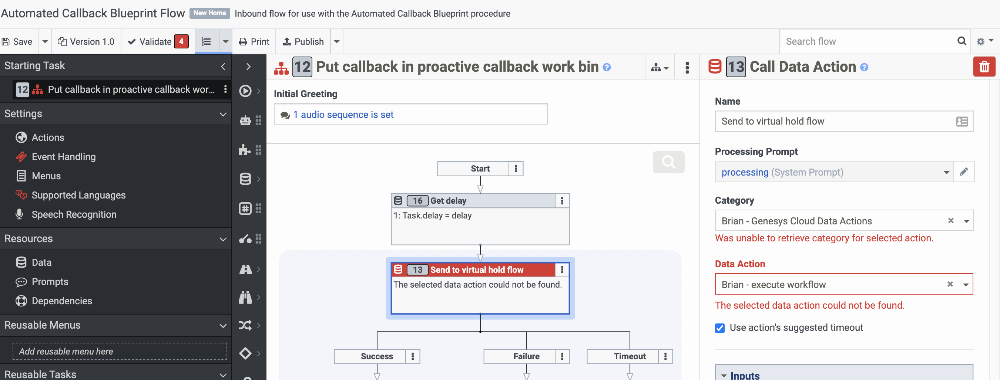
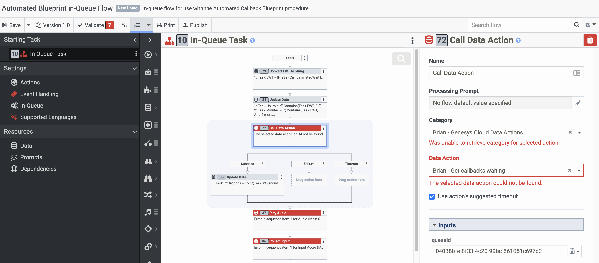

This Genesys Cloud Developer Blueprint explains how to configure automated callbacks using data actions to direct interactions through a series of Architect flows. The process explained in this blueprint adds calls to a workbin or holding queue and calculates the estimated wait time (EWT), timing the callback to match the time the caller would have spent on hold as closely as possible. While a caller's number waits in the holding queue, you can view it and even delete it, if necessary. To initiate the callback after the EWT, a data action adds the number to an agentless always-running outbound dialing campaign on Genesys Cloud. You can choose to have the person receiving the callback confirm that they still need help or send the call directly to an agent. By using a specially-configured holding queue for callback numbers, you can easily filter for these callbacks in reports.  


### Scenario

You want to offer your customers the option of a callback rather than waiting on hold for an agent and you want to automate the process of scheduling and initiating the callback. You need to generate an estimated wait time (EWT) that takes into account how long the callback you initiate will take to reach an agent, so that the caller's actual wait time is as close as possible to the expected wait time if they had remained on hold. You need to be able to view and edit the waiting callbacks to remove any that are no longer needed. And you need to be able to track end-to-end data on this callback process in your analytics tool.

### Solution

When a call arrives and the caller chooses a callback, the call is transferred first to an inbound flow that then passes it to a workflow flow type.

:::primary
**Note**: Using an inbound flow avoids incrementing abandons on the original target queue. Instead, it increments a flow-out that you can use in analytics reports. The inbound flow then triggers the workflow flow, which ends the original inbound call.
:::

The  workflow flow uses a modified EWT that accounts for both the system-generated EWT of the target queue and the additional EWT driven by existing waiting callbacks. The workflow flow performs the following main steps:
1. Creates a callback interaction in a queue used exclusively as a workbin to hold callbacks during the EWT period. Do not assign any agents to this holding queue.
2. Delays the appropriate minutes and seconds as calculated for the EWT.
3. After the EWT elapses, pushes the callback into the agentless campaign contact list with at minimum the callback number, the delay timer to be used for priority routing, and the conversationId of the callback in the workbin queue.

The agentless campaign automatically calls the original caller back and, if the callback is answered, provides the option to connect with an agent immediately. In either case, the outbound flow uses a data action to disconnect the associated callback object in the holding queue.

Callers wanting to speak with an agent are transferred to the target queue with the delay value used to set the priority of the call. Assuming all calls initially route with standard priority, the  callback moves to the front of the queue.

This solution has the following benefits:
* The EWT calculation for all new calls includes both calls in queue and waiting callbacks.
* Dashboards and performance views  provide insight into the usage and related metrics of waiting callbacks.
* If for some reason a callback should be canceled, authorized staff or IVR flows can disconnect callbacks in the holding queue, preventing the workflow flow from sending the related waiting callback to the outbound campaign.

The following flowchart shows how callbacks travel through the solution.


## Table of Contents

* [Solution components](#solution-components "Goes to the Solution components section")
* [Prerequisites](#prerequisites "Goes to the Prerequisites section")
* [Implementation steps](#implementation-steps "Goes to the Implementation steps section")
* [Additional resources](#additional-resources "Goes to the Additional resources section")

## Solution components

* **Genesys Cloud** - A suite of Genesys cloud services for enterprise-grade communications, collaboration, and contact center management. You configure flows, data actions, and outbound campaigns in Genesys Cloud.
* **Architect flows** - A flow in Architect, a drag and drop web-based design tool, dictates how Genesys Cloud handles inbound or outbound interactions. Preconfigured Architect flows provided with this blueprint simplify building the automated callback solution.
* **Data actions** - Either static (preconfigured) actions or custom actions that you create to leverage the Genesys Platform API. For example, use these data actions to make routing decisions within your interaction flow in Architect or to act on data in other ways. In this procedure, you use preconfigured data actions provided with this blueprint to simplify deployment of the automated callback solution.

## Prerequisites

### Specialized knowledge

* Administrator-level knowledge of Genesys Cloud
* Experience designing Architect flows
* Experience using data actions
* Experience configuring campaigns

### Genesys Cloud account

* Genesys Cloud 2+ license. For more information, see [Genesys Cloud Pricing](https://www.genesys.com/pricing "Opens the Genesys Cloud pricing page").
* (Recommended) The role of Master Admin. For more information, see the [Roles and permissions overview](https://help.mypurecloud.com/?p=24360 "Opens the Roles and permissions overview article").

### Preliminary considerations

Before you automate callbacks, consider the following points:

**Campaign pacing for your agent group**
* Are you planning to run other outbound campaigns with the same agent pool that is receiving the calls from the automated callback agentless campaign? Take this scenario into account when you configure campaign pacing.

**Callback reporting**
* Do you need to identify automated callbacks in your analytics reports? Reports based on callbacks generated by the agentless campaign require you to differentiate them from other outbound calls initiated within your organization. Reports based on the inbound queue that receives answered callbacks requires you to distinguish callbacks from other inbound traffic to that queue. Neither report type provides wait time information or accounts for scheduled callbacks that might be cancelled during the waiting period.

  To accurately track callbacks, identify them by filtering on the holding queue, which should have no traffic other than these automated callbacks.

**Calculating the wait time**
* How do you plan to determine when to dial callbacks? For example, should the delay simply be equal to the estimated wait time (EWT) or do you also need to consider certain conditions, such as when agent occupancy is at acceptable levels? Such wait time processing is handled in your Architect flows, because when your data action adds a record to the agentless campaign for a callback, it is dialed immediately.

## Implementation steps

1. [Create a queue to handle automated callbacks](#create-a-queue-to-handle-automated-callbacks "Opens the Create a queue to handle automated callbacks section")
2. [Create a contact list](#create-a-contact-list "Opens the Create a contact list section")
3. [Import the preconfigured data actions](#import-the-preconfigured-data-actions "Opens the Import the preconfigured data actions section")
4. [Import the preconfigured outbound flow into Architect](#import-the-preconfigured-outbound-flow-into-architect "Opens the Import the preconfigured outbound flow into Architect section")
5. [Create an outbound call analysis response](#create-an-outbound-call-analysis-response "Opens the Create an outbound call analysis response section")
6. [Create and configure an agentless campaign](#create-and-configure-an-agentless-campaign "Opens the Create and configure an agentless campaign section")
7. [Import the preconfigured workflow flow into Architect](#import-the-preconfigured-workflow-flow-into-architect "Opens the Import the preconfigured workflow flow into Architect section")
8. [Import the preconfigured inbound flow into Architect](#import-the-preconfigured-inbound-flow-into-architect "Opens the Import the preconfigured inbound flow into Architect section")
9. [Import the preconfigured in-queue flow into Architect](#import-the-preconfigured-in-queue-flow-into-architect "Opens the Import the preconfigured in-queue flow into Architect section")
10. [Configure the target queue for answered callbacks](#configure-the-target-queue-for-answered-callbacks "Opens the Configure the target queue for answered callbacks section")
11. [Test your solution](#test-your-solution "Opens the Test your solution section")

:::primary
**Note**:
This blueprint uses a number of preconfigured files you import in the following steps to use as a basis for building your automated callback solution. These include data actions, Architect flows, and a calling list template file. Download the files from the [GitHub repository for this blueprint](https://github.com/GenesysCloudBlueprints/automated-callback-blueprint/files "Opens the file folder in the GitHub repository for this blueprint").
:::

### Create a queue to handle automated callbacks

In this solution, callbacks waiting for their time to come are held in a designated queue that functions as a workbin. You must configure this queue specifically for use with this callback solution. Do not assign any agents as members to this designated queue, nor route calls or digital interactions to it.

For more information, see [Create queues](https://help.mypurecloud.com/articles/?p=52745 "Opens the Create queues series of articles").

### Create a contact list

Create a contact list to which you can add contacts by using a preconfigured data action that calls the API. Use the calling list template file **proactive-callback-contactlist-template.csv** as a starting point. Download the template file from the [GitHub repository for this blueprint](https://github.com/GenesysCloudBlueprints/automated-callback-blueprint/files "Opens the file folder in the GitHub repository for this blueprint").

This contact list requires the following four fields:
* Phone - The caller's ANI.
* Name - The caller's name.
* Delay - The call's expected wait time when the callback is requested. This is the virtual hold time that elapses before the call is added to the agentless campaign.
* callbackId - The GUID for the callback.

For more information, see [Dialer Call List Management](https://developer.mypurecloud.com/api/tutorials/call-list-management/index.html?language=python&step=1 "Opens the Dialer Call List Management page") in the Genesys Cloud Developer Center.

### Import the preconfigured data actions

Import the following five preconfigured data action JSON files into your Genesys Cloud **Integration** > **Actions** workspace:

* ```Create-placeholder-callback.custom.json``` - Creates a callback interaction in the holding queue you create.
* ```Add-contact-to-contact-list.custom.json``` - Inserts contact numbers into the campaign for callbacks after the correct EWT has elapsed.
* ```Get-callbacks-waiting.custom.json``` - Retrieves the number of callbacks and how long a new callback has to wait.
* ```Execute-workflow.custom.json``` - Runs the Architect workflows you import in the following procedures.
* ```Get-interaction-state.custom.json``` - Checks whether the callback has been cancelled while waiting in the holding queue before initiating the outbound callback to the customer.

The implementation steps that follow explain how to use these data actions. Customize them as necessary to work correctly in your environment. For more information, see [About the Genesys Cloud data actions integration](https://help.mypurecloud.com/articles/?p=144553 "Opens the About the Genesys Cloud data actions integration article") in the Genesys Cloud Resource Center.

### Import the preconfigured outbound flow into Architect

1. Import the ```Proactive_callback_v1-0.i3OutboundFlow``` file from the [GitHub repository for this blueprint](https://github.com/GenesysCloudBlueprints/automated-callback-blueprint/files "Opens the file folder in the GitHub repository for this blueprint") into Architect.
2. Associate this flow with the contact list you created in [Create a contact list](#create-a-contact-list "Jumps to the Create a contact list section").
3. Update Action Block 21 in the outbound flow, which is a Transfer to ACD action, to target the queue in which the call will be answered.

  

For more information, see the [Architect overview](https://help.mypurecloud.com/articles/?p=1441 "Opens the Architect overview article") in the Genesys Cloud Resource Center.

### Create an outbound call analysis response

Create an outbound call analysis response that transfers live voice responses to the outbound flow imported in [Import the preconfigured outbound flow into Architect](#import-the-preconfigured-outbound-flow-into-architect "Jumps to the Import the preconfigured outbound flow into Architect section"). This call analysis response is used when you configure the agentless campaign in [the following step](#create-and-configure-an-agentless-campaign "Jumps to the Create and configure an agentless campaign section").

For more information, see [Create a call analysis response](https://help.mypurecloud.com/articles/?p=21388 "Opens the Create a call analysis response article")

### Create and configure an agentless campaign

Set up a campaign that automatically starts calls when your data action adds them to the contact list (this data action is activated in a subsequent step). The outbound-dialer campaign calls the contacts using call-progress detection (CPD). Subsequent steps explain how to direct the live person or answering machine who answers the call to the Architect flow you want to have handle each type of answered call.

1. Configure an agentless campaign, setting values for all required and optional fields and including the contact list configured in [Create a contact list](#create-a-contact-list "Jumps to the Create a contact list section").

  a. Set the **Number of Outbound Lines** to be appropriate for the volume of simultaneous proactive callbacks anticipated at peak capacity.

  b. Select an appropriate **Site** or Edge Group to use for outbound telephony.

  c. Designate a suitable **Caller ID Phone Number**, such as the number assigned to the original queue, and **Caller ID Name**.


2. In the **Campaign** configuration window, open the **Advanced** settings and choose **Always Running**.


3. In the **Call Analysis Response Name** field, enter the name of the call analysis response you created in [the previous procedure](#create-an-outbound-call-analysis-response "Jumps to the Create an outbound call analysis response section").


### Import the preconfigured workflow flow into Architect

1. Import the ```Proactive_callback_v1-0.i3WorkFlow``` file from the [GitHub repository for this blueprint](https://github.com/GenesysCloudBlueprints/automated-callback-blueprint/files "Opens the file folder in the GitHub repository for this blueprint") into Architect.
2. Configure the following blocks in the flow:

  a. Map each Call Data Action in the following action blocks to the data actions integration into which you imported the preconfigured data actions in [Import the preconfigured data actions](#import-the-preconfigured-data-actions "Jumps to the Import the preconfigured data actions section") and specify the name of the data action:

    * 17 - Create placeholder callback data action
    * 21 - Get interaction state data action
    * 15 - Add contact to contact list data action

    

  b. Replace the default Literal value for the **Inputs** > **queueId** field in Action Block 17 with the Id of the queue you created in [Create a queue to handle automated callbacks](#create-a-queue-to-handle-automated-callbacks "Jumps to the Create a queue to handle automated callbacks section").

  c. Replace the default Literal value for the **Input** > **contactListId** field in Action Block 15 with the Id of the contact list you created in [Create a contact list](#create-a-contact-list "Jumps to the Create a contact list section").

### Import the preconfigured inbound flow into Architect

1. Import the ```Trigger_proactive_callback_workflow_v1-0.i3InboundFlow``` file from the [GitHub repository for this blueprint](https://github.com/GenesysCloudBlueprints/automated-callback-blueprint/files "Opens the file folder in the GitHub repository for this blueprint") into Architect.
2. Configure the following block in the flow:

  a. Map the Call Data Action in Action Block 13 to the integration location where you imported the data actions and specify the execute workflow data action.

  b. Update the default Literal value for the **Input** > **flowId** field in Action Block 13 with the Id of the workflow flow you configured in [Import the preconfigured workflow flow into Architect](#import-the-preconfigured-workflow-flow-into-architect "Jumps to the Import the preconfigured workflow flow into Architect section").


### Import the preconfigured in queue flow into Architect

1. Import the ```Proactive_callbacks_v1-0.i3InQueueFlow``` file from the [GitHub repository for this blueprint](https://github.com/GenesysCloudBlueprints/automated-callback-blueprint/files "Opens the file folder in the GitHub repository for this blueprint") into Architect.
2. Configure the following action blocks in the flow:

  a. Map the Call Data Action in Action Block 72 to the integration in which the data actions were imported and specify the name of the data action.

  b. Update the default Literal value for the **Input** > **queueId** field in Action Block 72 with the Id of the queue created in [Create a queue to handle automated callbacks](#create-a-queue-to-handle-automated-callbacks "Jumps to the Create a queue to handle automated callbacks section").
  

  c. Update the Transfer to ACD Action Block 91 with the inbound flow name you specified in [Import the preconfigured inbound flow into Architect](#import-the-preconfigured-inbound-flow-into-architect "Jumps to the Import the preconfigured inbound flow into Architect section").

### Configure the target queue for answered callbacks

Configure the queue to which answered callbacks should be assigned so that it uses the in-queue flow you configured in [Import the preconfigured in queue flow into Architect](#import-the-preconfigured-in-queue-flow-into-architect "Jumps to the Import the preconfigured in queue flow into Architect section").

### Test your solution

Ensure that your Architect flows handle requests for automated callbacks as desired.

## Additional resources

* [Transfer to ACD action](https://help.mypurecloud.com/articles/?p=7192 "Opens the Transfer to ACD action article") in the Genesys Cloud Resource Center
* [Advanced routing overview](https://help.mypurecloud.com/articles/?p=204014 "Opens the Advanced routing overview article") in the Genesys Cloud Resource Center
* [Architect overview](https://help.mypurecloud.com/articles/?p=1441 "Opens the Architect overview article") in the Genesys Cloud Resource Center
* [Callbacks in Architect](https://help.mypurecloud.com/articles/?p=77106 "Opens the Callbacks in Architect article") in the Genesys Cloud Resource Center
* [Create queues](https://help.mypurecloud.com/articles/?p=52745 "Opens the Create queues series of articles") in the Genesys Cloud Resource Center
* [About the Genesys Cloud data actions integration](https://help.mypurecloud.com/articles/?p=144553 "Opens the About the Genesys Cloud data actions integration article") in the Genesys Cloud Resource Center
